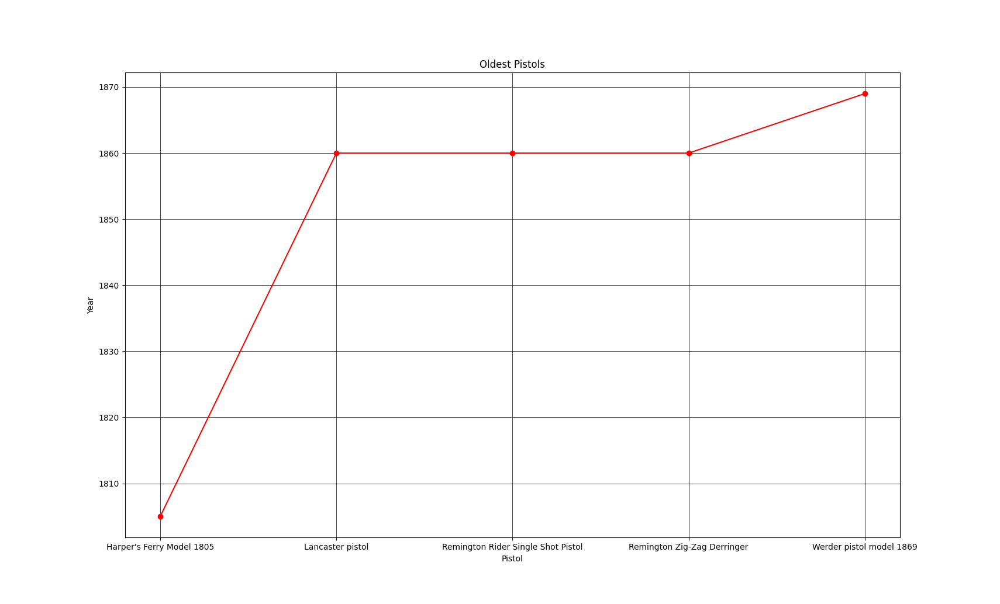
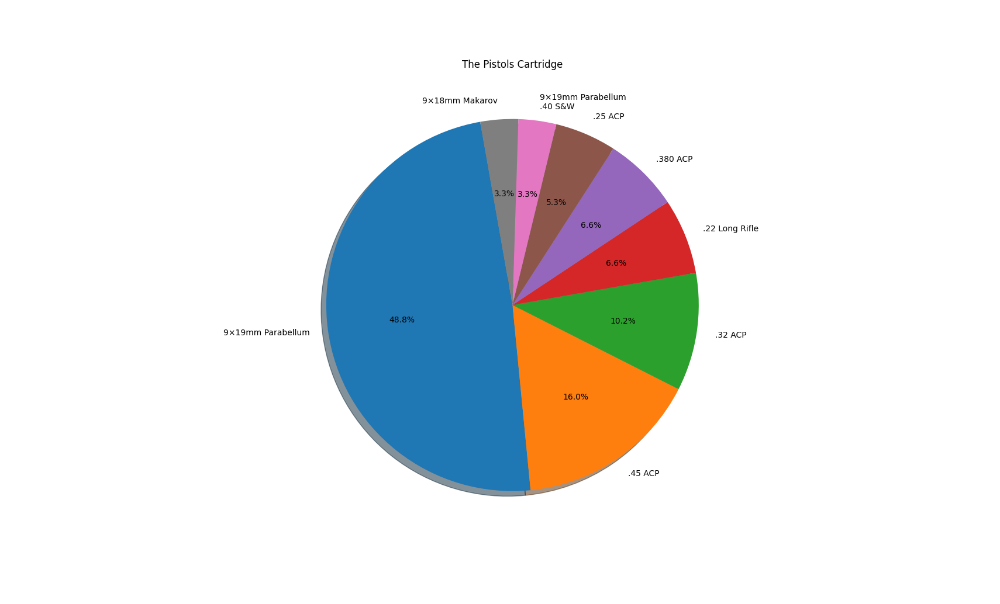
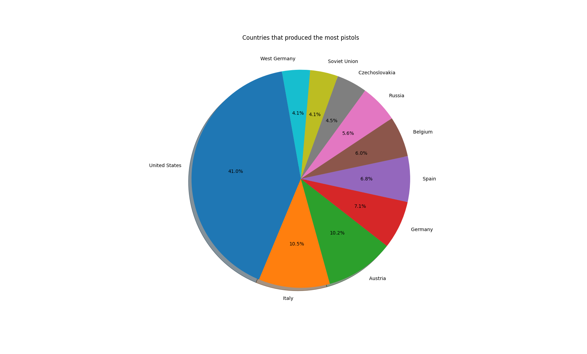
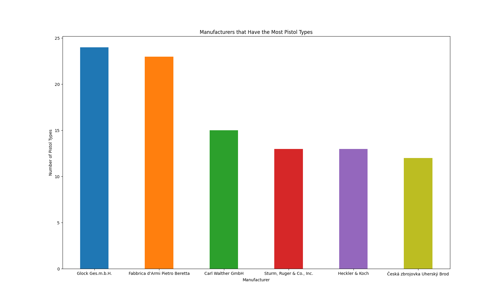

# Pistols Data Analysis 🧐🔫

A Python project showcasing **data analysis and visualization** skills using a dataset of pistols.  
This project demonstrates how to clean, manipulate, and visualize data using **Pandas** and **Matplotlib**.

---

## 📂 Dataset

The project uses `ListOfPistols.csv`, which contains information about various pistols:

- **Name**  
- **Year of introduction**  
- **Cartridge type**  
- **Manufacturer**  
- **Country of origin**  

---

## 📊 Visualizations

This project includes multiple insightful visualizations:

1. **Oldest Pistols**  
   Line chart showing the 5 oldest pistols in the dataset.
   


3. **Pistols Cartridge Distribution**  
   Pie chart displaying the most common pistol cartridges.
   


5. **Top Pistol-Producing Countries**  
   Pie chart showing which countries produced the most pistols.
   


7. **Manufacturers with Most Pistol Types**  
   Bar chart highlighting manufacturers with the largest number of pistol models.
   


---

## 🛠️ Technologies Used

- **Python** – Programming language for data analysis  
- **Pandas** – Data manipulation and aggregation  
- **Matplotlib** – Data visualization  

---

## ⚡ How to Run

Clone the repository and navigate to the project folder:

```bash
git clone https://github.com/askoti/pistols_da.git
cd pistols_da
```
Install dependencies:
```bash
pip install pandas matplotlib
```

Run the application:
```bash
python app.py
```

Follow the prompts to view different visualizations.

---

## 🎯 Purpose

This project demonstrates:
- Data cleaning and aggregation with Pandas
- Creating visual insights with Matplotlib
- Presenting data analysis in a structured, professional manner
- It’s a clear example of my ability to handle Python-based data analysis projects from start to finish.

---

## ✅ Skills Highlighted

- Python programming
- Data analysis & manipulation
- Data visualization & storytelling
- Problem-solving with real-world datasets

---
